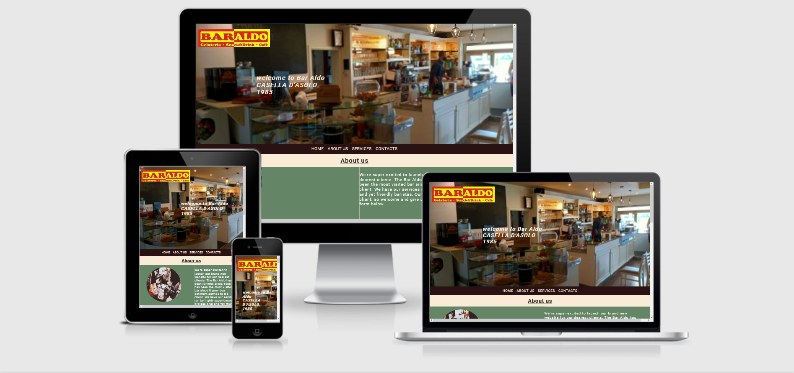
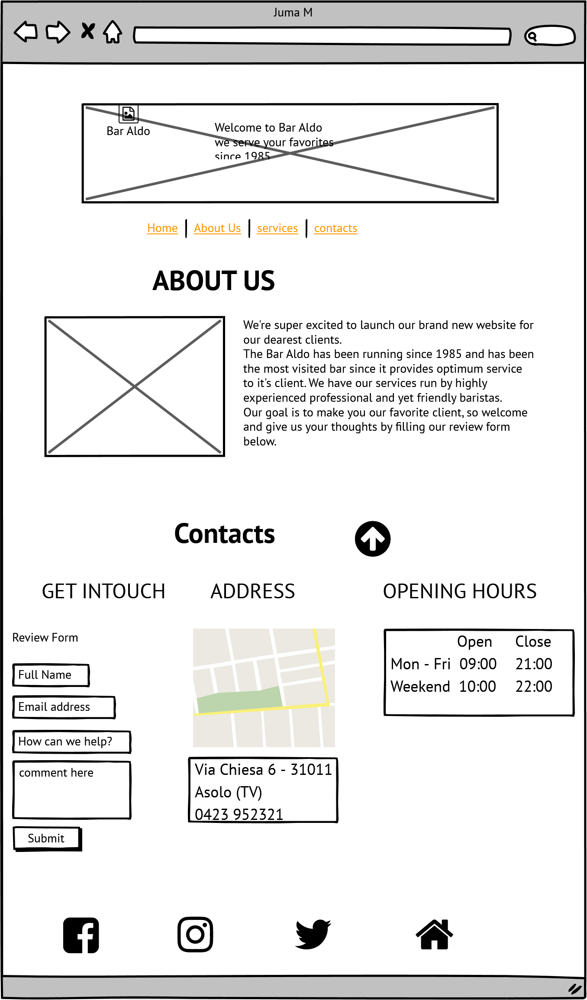
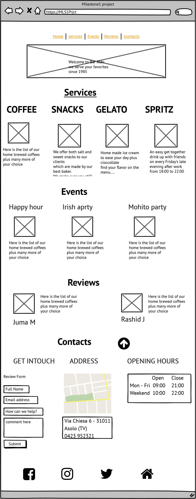
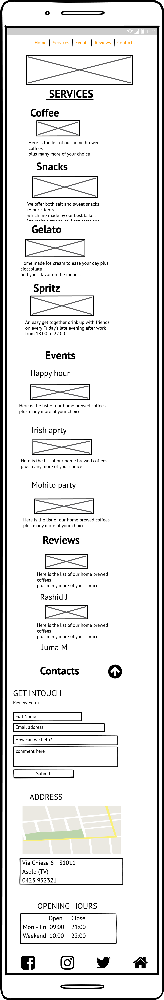
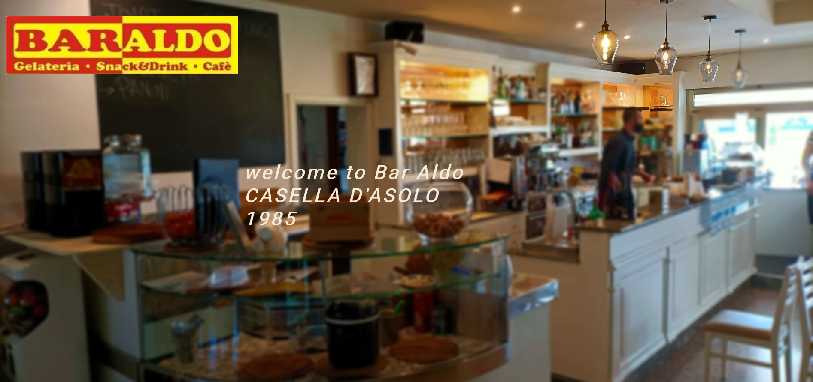
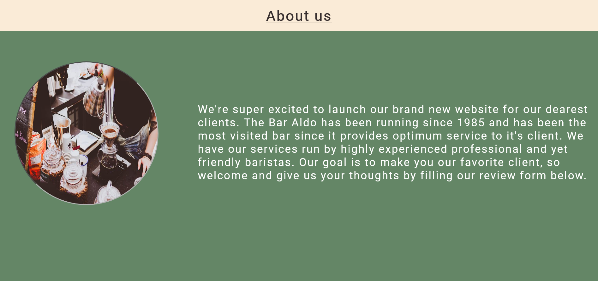
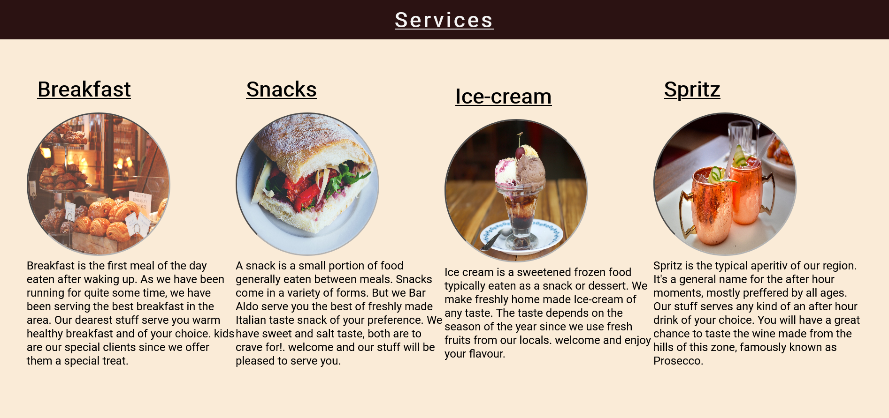
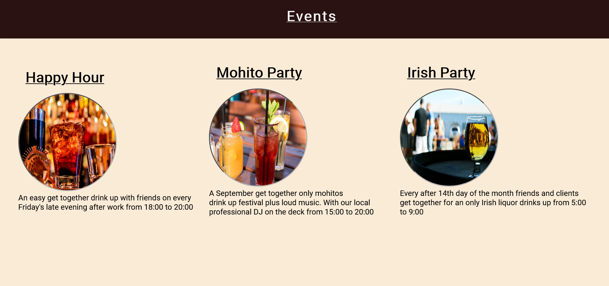
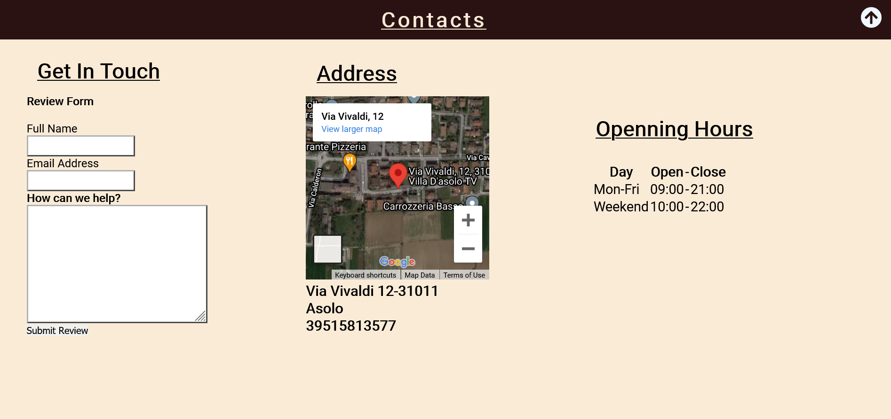

# Bar Aldo Coffe Shop

## Introduction

Welcome to my first project. This project is a website based on a local coffee shop called Bar Aldo found in 3km away from the center of one of the Italian most famouse villages around the venetian region on the North Eastern part of Italy. As many different countries in different continent consider the bar being a place to find only liquor yet in Italy it's a place you can find both coffee,snacks,liquor and ice-cream. 
A bar is considered a place to hang out with friends and family having coffee or a snack together, most people have breakfast at the bar on weekends in Italy.
This website shows you how much you can find in a bar in Italy .

A live website can be found [here](https://rj12-art.github.io/MLS1/).

# Table of Contents
  * [Bar Aldo. Coffee, Snacks And Ice-cream Shop](#Bar-aldo)
 # Table of Contents
- [1. UX](#ux)
  * [1.1. Strategy](#strategy)
    + [Project Goals](#project-goals)
      - [User Goals:](#user-goals)
      - [User Expectations:](#user-expectations)
  * [1.2. Structure](#structure)
  * [1.3. Skeleton](#skeleton)
  * [1.4. Surface](#surface)
- [2. Features](#features)
- [3. Technologies Used](#technologies-used)
- [4. Testing](#testing)
- [5. Development Cycle](#development-cycle)
- [6. Deployment](#deployment)
- [7. End Product](#end-product)
- [8. Known Bugs](#known-bugs)
- [9. Credits](#credits)

# 1. UX
  [Go to the top](#table-of-contents)
### i project research

As a person who enjoys going out for a drink on friday evenings and over the weekends. I have always tried visiting as many coffee shops as I can, Just to pick one that can be my favourite depending on the services,events and the taste of what they serve.
This project will showcase the services and events that Bar Aldo is proven a one of a kind in the whole village.

### ii project Goals

The main goal of this website is to show-case the products this coffee shop makes and with intention of attracting more clients. I want to demonstrate the target audience why  bar Aldo is a place to go for an occassion.

### iii User Expectaionts:
 * First Time Visitor expectations
    - As a First Time Visitor, I want to learn about the history of this Bar and understand what products the offer the clients.

    - As a First Time Visitor, I want to be able to easily navigate throughout the site to find content.

 * Returning User expectations

    - As a Returning Visitor, I want to find information about Bra Aldo.

    - As a Returning Visitor, I want to find the best way to get in contact with the coffee shop with any questions I may have.

* Frequent User expectations

- As a Frequent User, I want to check to see if there are any newly added products or events.

- As a Frequent User, I want to check to see if any other abrista is hired or left.
    The content should prove why Bar Aldo is one of the most highly recommended Coffee shop within the village.
- The content is displayed in a clear and understanding format.
- The user interface is easy to navigate.
- The website is responsive on all devices this includes mobile, tablet and desktop.
- To have the ability to contact the creator of the website.

 
## 1.2. Structure
  [Go to the top](#table-of-contents)

It is really important to include responsive design in this project as many users are using different devices (mobile, tablet, laptop/PC). This gives the user the best experience on their device.

 - Responsive on all devices sizes
 - Navigation bar is placed on the top left of the screen and is clear and easy to use. This is also placed in the same position on every page.
 - Footer at the bottom of each page that links to the social media websites.
 - All elements will be consistent including font size, font family, colour scheme.

## 1.3. Skeleton
  [Go to the top](#table-of-contents)

I used [Balsamiq](https://balsamiq.com/) to create my wireframes as this gives the template of the UI. This also shows where all elements will be placed within the screen.

There are 2 versions of each wireframe as one shows the design on a web browser and the other shows a mobile browser format.

### Wire-frames
Web browser full page preview

Mobile browser full page preview

Web browser service full page preview

Mobile browser service full page preview

## 1.4. Surface
  [Go to the top](#table-of-contents)

### Colours
Please find the colours schemes that I used [here](https://coolors.co/34495e-ffffff-e74c3c-3a3a3a-fafafa).

### Typography
I decided to use Roboto as my font of choice with sans serf as my backup font for browsers that might not support Roboto.

# 2. Features
  [Go to the top](#table-of-contents)

### All pages:
- Navigation bar is placed at the top of the home page of the screen, for ease of use and consistency. It has a hover effect to improve the user experience.
- Social media links, - all links are placed at the bottom of the page in the footer. All links open in a new tab.
- Logo/image - a Bar Aldo logo is also placed on the top left ofthe page. This gives the context that the website is about the Bar.

### Home section:
- Main image - a large image that shows what the website is about.
-  Bar-logo - These image adds a visual to UI and improving UX as it's not just text on the page.

### About-Us section:
-About-Us, A little introduction about the coffee shop.
-Tells the user what they may expect in terms of the history of the bar and why it's still running.

### Services section:
- service - this element shows what kind of services the bar offers.
- And which kind of service products the bar offers to the clients.

### Events section:
-This element shows what kind of events the bar hosts and their appropriate dates and time.
-And which kind of event might be of the user's/client's intyerest.
### Contact section:
- Contact form - this gives the user the ability to message me for any issues they are having with the site.
-  Any suggestions of improvement and to give their opinions on any matter that could be of use.

### Features to be implemented in the future
 -Linked pages with alert texts.
 -video elements of every event.

## 3. Technologies Used
  [Go to the top](#table-of-contents)

* [HTML5](https://en.wikipedia.org/wiki/HTML)
  * The project uses HyperText Markup Language.
* [CSS3](https://en.wikipedia.org/wiki/CSS)
  * The project uses Cascading Style Sheets.
* [Visual studio code](https://vsc.io/)
  - The project uses Visual studio code to code.
* [Chrome](https://www.google.com/intl/en_uk/chrome/)
  - The project uses Chrome to debug and test the source code using HTML5.
* [Balsamiq](https://balsamiq.com/)
  - Balsamiq was used to create the wireframes during the design process.
* [Google Fonts](https://fonts.google.com/)
  - Google fonts were used to import the "Roboto" font into the style.css file which is used on all pages throughout the project.
* [GitHub](https://github.com/)
  - GitHub was used to store the project's code after being pushed from Git.
* [JS Fiddle](https://jsfiddle.net/)
  - JS Fiddle was used as a playground to test all my code before committing.

# 4. Testing
  [Go to the top](#table-of-contents)

## Testing with tools
### Google Developer Tools

For every element that I added to my HTML, I would add the basic CSS to my stylesheet. I would then use the inspect element to try different styles. Once I've got it to my liking I would copy the CSS from google into my stylesheet. This allows me to keep track of the code I am using.

### Responsive Tools

I used [Am I Responsive](http://ami.responsivedesign.is/) to make sure that all my pages are responsive to all devices.

### W3C Validator Tools

I used [W3C Markup](https://validator.w3.org/#validate_by_input+with_options) to check for any errors within my HTML pages.
The pages showed no errors after every code validation.
.

I used [W3C CSS Validation](https://jigsaw.w3.org/css-validator/) to check for any error within my CSS stylesheet.
The stylesheet showed no errors after every code validation.
.

I also used google chrome's lighthouse to check for page performance and the results are as shown on the screenshot below.
.

## Manual Testing

I have tested my site on firefox and google chrome on multiple devices.
I also used [Lighthouse](https://lighthouse.net/) as a playground to test all of my code before staging and committing any changes.

These include:
  - iPhone X
  - iPhone XS Max
  - iPad Pro
  - ipad
  - laptop 

Please find below my testing process for all pages via mobile and web:

### All pages:
  - Navigation Bar:
    - Home - When selecting "home", the browser redirects me to the home page. The text in the navigation bar also stays highlighted with bottom line. It worked as expected.
    - service - When selecting "service", the browser redirects me to the service page. The text in the navigation bar also stays highlighted in underlined. It worked as exspected.

    - Text:
      - I checked that all text is in the correct and consistent size and font. I also checked that there were no typos.

    - Media:
      - I checked that all images on this sections load. Making sure that all images have alt text if media does not load. It worked as expected.

    - Responsiveness
      - I checked that all sections and elements were responsive. Checking each section on mobile and website and adjusting screen size to find break points. It worked as expected.

  - Footer:
    - Instagram -  When selecting the Instagram icon, a new tab opens and redirects to the Instagram website. It worked as expected.
    - Facebook - When selecting the Facebook icon, a new tab opens and redirects to the Facebook website. It worked as expected.
    - YouTube - When selecting the YouTube icon, a new tab opens and redirects to the YouTube website. It worked as expected.
    - linked - when selecting the linked icon, a new tab opens and redirects to the linked website.
    - Home - when selecting the home icon, it redirects a user to the top of the home page of the website.

### Home page:
   -Checking the elements responding to the screen size.
   -I made sure the images adjust according to the decreas and increas in screen size, it worked as expected.
   
### Service page:
   -I made sure the page responds to every device's screen display by decreasing and increasing the web view.
   -I also made sure the images on the sections load and all worked as expected.
   
   

# 5. Development Cycle
  [Go to the top](#table-of-contents)

There were many elements I changed, re-positioned and added from my original wireframes as they were more visually appealing.

### All pages:
 -The service page was added as an external html file to add more room to the code and the page.
### Home page:
  - The original wireframe was tottally changed since the home page contained only three sections. 
  - The navbar is at the bottom of the home page image and with all the elements to navigate through.
### About section:
  - I didnt change a thing with the story and the image found on the about section but I did a bit of styling to have them positioned well on all screen previews.
### Service page:
  - The original wireframe showed this page as a section on the home page but with the new wireframes this was turned into a separate page which contained other section for the web site. The navbar in this page is situated on the top of the page and the logo image was not included since it wasn't offering a better view structure.
### Event section:
  - The event section on the mobile preview the images needed to be centered and the margin and padding was added to make that change.

### Review section:
  - This section was added after the adjustment of contents on the site and more contents were required to be added, this section is found on the service page when the user clicks a service element on the service's page navbar.

### Contact page:
 - On the old wireframes the contacts elements weren't well structured and styled,but after restructuring the project the need to add padding and margin on the contact elements was made to have better view of the full site.
 - The rebon contains the text and the arrow icon got from font awesome which redirects the user on the home page to the menu bar while on the service page the arrow was excluded since the navbar is positioned fixed right on top of the page the elements are well navigabe, but the arrow isn't responsive on moblie preview.

# 6. Deployment
  [Go to the top](#table-of-contents)

I used GitHub pages to deploy my final project. To do this I had to do the following steps:
1. Create a repository on GitHub.
2. Clone the repository on your chosen source code editor (Atom in my case) using the clone link.
4. Add files to Git (staging area) and use the atom commit to master button.
5. Use git within atom to push the code.
7. Go to GitHub and load your repository.
8. Select settings.
9. Select pages on the left menu bar.
10. Click on the master branch.
11. This will now generate a link with your website live.
   
 
# 7. End Product
  [Go to the top](#table-of-contents)

  Please fine below a screenshot of each page:

  Home section UI:
  
  
   About section UI:
  

  Service section UI:
  

  Events section UI:
  

  Review section UI:
  

  Contact section UI:
  

# 8 . Known Bugs
  [Go to the top](#table-of-contents)

* Background-Image
 - The background image at the top of the website wasn't loading so it was a heck of a strugle and I had to check on the url how the file path is written and it turned out the file path was misswritten so I corrected and it loadded as expected.

 * The service page
 - I had a tough moment trying to systemize the folders and the files to make the project look neat by separating most files and folders to avoid confusion but by doing so my home page wasn't responsive because I created a folder for the service page and linked it to the home page which was responsive but accessing the home page from the service page was not responsive so I had to move the service page out of the folder I created for it and left it out with the main index file then all the links and pages were responsive.

* Contact arrow.
- The arrow is not responsive on mobile previews.

* h3-headings
 -Are not centered like the images on the mobile previews purposely to create a different view of elements, centering them seemed kinda boring to the user so they are designed to not center along with the images since the content's headings are already centered.
 

# 9. Credits
 I would like to tahnk my mentor Marcel for the help and support he has been offering me from the start to the end of the project.
  [Go to the top](#table-of-contents)

### Code
 * The navigation bar code was inspired by small Cafe website
 * A full page layout was inspired by small Cafe website 
 * image style was inspired by the Love Running projects and small Cafe 
 * The footer idea code came from the Love Running projects
 * The icons in the footer and contact page came from [Font Awesome](https://fontawesome.com/)

### Content
 * All information on index.html was generated by user perception and research interviews.
 * Most images came from [Pixabay](https://pixabay.com/)
