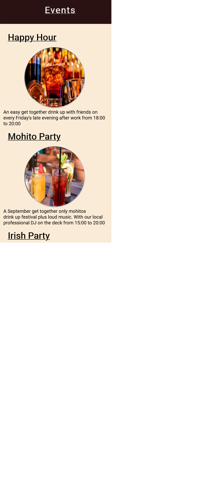
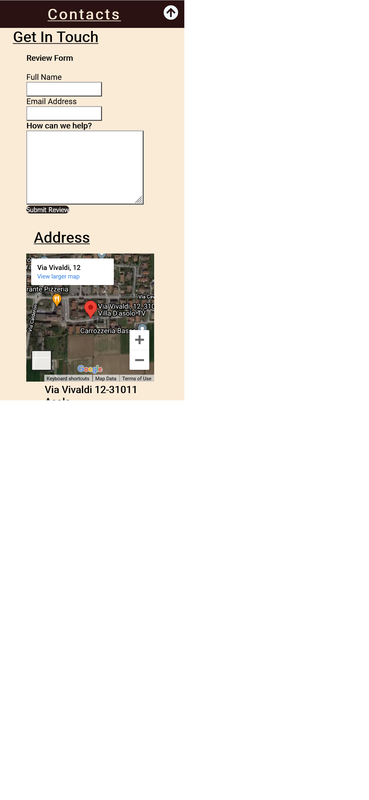

# Bar Aldo Coffe Shop

## Introduction

Welcome to my first project. This project is a website based on a local coffee shop called Bar Aldo found in 3km away from the center of one of the Italian most famouse villages around the venetian region on the North Eastern part of Italy. As many different countries in different continent consider the bar being a place to find only liquor yet in Italy it's a place you can find both coffee,snacks,liquor and ice-cream. 
A bar is considered a place to hang out with friends and family having coffee or a snack together, most people have breakfast at the bar on weekends in Italy.
This website shows you how much you can find in a bar in Italy .

A live website can be found [here](https://rj12-art.github.io/MLS1/).

# Table of Contents
  * [Bar Aldo. Coffee, Snacks And Ice-cream Shop](#Bar-aldo)
  ## 1. [UX](#ux)
    * [Project Research](#project-research)
        + [Research Analysis](#research-analysis)
    * [Project Goals](#project-goals)
    * [User expectations](#user-expectations)
    * [Wireframes](#wireframes)
  ## 2. [Design](#design)
    * [Colour Scheme](#colour-scheme)
    * [Favicon](#favicon)
    * [Typography](#typography)
    * [Imagery](#imagery)
  ## 3. [Features](#features)
    * [Existing Features](#existing-features)
    * [Features to be Implemented in Future](#features-to-be-implemented-in-future)
  ## 4. [Technologies Used](#technologies-used)
    * [Languages](#languages)
    * [Frameworks & Libraries](#frameworks---libraries)
  ## 5. [Testing](#testing)
    * [User Stories Testing](#user-stories-testing)
    * [Manual Testing](#additional-testing)
        + [Ongoing Bugs](#ongoing-bugs)
  ## 6. [Deployment](#deployment)
    * [GitHub Pages](#github-pages)
    * [Forking the Published GitHub Repository](#forking-the-published-github-repository)
    * [Cloning the Published GitHub Repository](#cloning-the-published-github-repository)
  ## 7. [Credits](#credits)
    * [Imagery](#imagery-1)
    * [Code](#code)
    * [Acknowledgements](#acknowledgements)

# 1. UX
  [Go to the top](#table-of-contents)

### i project research

As a person who enjoys going out for a drink on friday evenings and over the weekends. I have always tried visiting as many coffee shops as I can, Just to pick one that can be my favourite depending on the services,events and the taste of what they serve.
This project will showcase the services and events that Bar Aldo is proven a one of a kind in the whole village.

### ii project Goals

The main goal of this website is to show-case the products this coffee shop makes and with intention of attracting more clients. I want to demonstrate the target audience why  bar Aldo is a place to go for an occassion.

### iii User Expectaionts:
 * First Time Visitor expectations
    - As a First Time Visitor, I want to learn about the history of this Bar and understand what products the offer the clients.

    - As a First Time Visitor, I want to be able to easily navigate throughout the site to find content.

 * Returning User expectations

    - As a Returning Visitor, I want to find information about Bra Aldo.

    - As a Returning Visitor, I want to find the best way to get in contact with the coffee shop with any questions I may have.

* Frequent User expectations

- As a Frequent User, I want to check to see if there are any newly added products or events.

- As a Frequent User, I want to check to see if any other abrista is hired or left.
    The content should prove why Bar Aldo is one of the most highly recommended Coffee shop within the village.
- The content is displayed in a clear and understanding format.
- The user interface is easy to navigate.
- The website is responsive on all devices this includes mobile, tablet and desktop.
- To have the ability to contact the creator of the website.

### iv Wireframes
* 

* 

  ## 5. Design

## i Structure
  [Go to the top](#table-of-contents)

It is really important to include responsive design in this project as many users are using different devices (mobile, tablet, laptop/PC). This gives the user the best experience on their device.

 - Responsive on all devices sizes
 - Navigation bar is placed beneath the home page image and is clear and easy to use.
 - Footer at the bottom of the page that links to the social media websites.
 - All elements will be consistent including font size, font family, colour scheme.
 
  ###  Colour scheme
Since the website is displaying edible products, I had to be critical in color mixture [here](https://www.color-hex.com/color-wheel/).

### Typography
I decided to use Roboto as my font of choice with sans serf as my backup font for browsers that might not support Roboto.

## Favicon
I used fontawesome to import icons I could use on the sections [fontawesome](https://fontawesome.com/)

# 3. Features
  [Go to the top](#table-of-contents)

### All pages:
- Navigation bar is placed at the lower part of the home page of the screen, for ease of use and consistency. It has a hover effect to improve the user experience.
- Social media links, - all links are placed at the bottom of the page in the footer. All links open in a new tab.
- Logo/image - a Bar Aldo logo is also placed on the top left ofthe page. This gives the context that the website is about the Bar.

### Home section:
- Main image - a large image that shows what the website is about.
-  Bar-logo - These image adds a visual to UI and improving UX as it's not just text on the page.

### About-Us section:
-About-Us, A little introduction about the coffee shop.

### Services section:
- service - this element shows what kind of services the bar offers.

### Events section:
This element shows what kind of events the bar hosts and their appropriate dates and time.

### Events mobile preview:

### Contact section:
- Contact form - this gives the user the ability to message me for any issues they are having with the site, any suggestions of improvement and to give their opinions on any matter that could be of use. 
### contact mobile view

### Features to be implemented in the future
 -Linked pages with alert texts.
 -video elements of every event.

## 3. Technologies Used
  [Go to the top](#table-of-contents)

* [HTML5](https://en.wikipedia.org/wiki/HTML)
  * The project uses HyperText Markup Language.
* [CSS3](https://en.wikipedia.org/wiki/CSS)
  * The project uses Cascading Style Sheets.
* [Visual studio code](https://vsc.io/)
  - The project uses Visual studio code to code.
* [Chrome](https://www.google.com/intl/en_uk/chrome/)
  - The project uses Chrome to debug and test the source code using HTML5.
* [Balsamiq](https://balsamiq.com/)
  - Balsamiq was used to create the wireframes during the design process.
* [Google Fonts](https://fonts.google.com/)
  - Google fonts were used to import the "Roboto" font into the style.css file which is used on all pages throughout the project.
* [GitHub](https://github.com/)
  - GitHub was used to store the project's code after being pushed from Git.
* [JS Fiddle](https://jsfiddle.net/)
  - JS Fiddle was used as a playground to test all my code before committing.

# 4. Testing
  [Go to the top](#table-of-contents)

## Automated testing
### Google Developer Tools

For every element that I added to my HTML, I would add the basic CSS to my stylesheet. I would then use the inspect element to try different styles. Once I've got it to my liking I would copy the CSS from google into my stylesheet. This allows me to keep track of the code I am using.

### Responsive Tools

I used [Am I Responsive](http://ami.responsivedesign.is/) to make sure that all my pages are responsive to all devices.

### W3C Validator Tools

I used [W3C Markup](https://validator.w3.org/#validate_by_input+with_options) to check for any errors within my HTML pages.
The pages showed no errors after every code validation.

I used [W3C CSS Validation](https://jigsaw.w3.org/css-validator/) to check for any error within my CSS stylesheet.

## Manual Testing

I have tested my site on firefox and google chrome on multiple devices.
I also used [Lighthouse](https://lighthouse.net/) as a playground to test all of my code before staging and committing any changes.

These include:
  - iPhone X
  - iPhone XS Max
  - iPad Pro
  - ipad
  - laptop 

    - Text:
      - I checked that all text is in the correct and consistent size and font. I also checked that there were no typos.

    - Media:
      - I checked that all images on this sections load. Making sure that all images have alt text if media does not load. It worked as expected.

    - Responsiveness
      - I checked that all sections and elements were responsive. Checking each section on mobile and website and adjusting screen size to find break points. It worked as expected.

  - Footer:
    - Instagram -  When selecting the Instagram icon, a new tab opens and redirects to the Instagram website. It worked as expected.
    - Facebook - When selecting the Facebook icon, a new tab opens and redirects to the Facebook website. It worked as expected.
    - YouTube - When selecting the YouTube icon, a new tab opens and redirects to the YouTube website. It worked as expected.
    - linked - when selecting the linked icon, a new tab opens and redirects to the linked website.
    - Home - when selecting the home icon, it redirects a user to the top of the home page of the website.

# 6. Deployment
  [Go to the top](#table-of-contents)

I used GitHub pages to deploy my final project. To do this I had to do the following steps:
1. Create a repository on GitHub.
2. Clone the repository on your chosen source code editor (Atom in my case) using the clone link.
4. Add files to Git (staging area) and use the atom commit to master button.
5. Use git within atom to push the code.
7. Go to GitHub and load your repository.
8. Select settings.
9. Select pages on the left menu bar.
10. Click on the master branch.
11. This will now generate a link with your website live.

## . Known Bugs
  [Go to the top](#table-of-contents)

* Background-Image
 - The background image at the top of the website wasn't loading so it was a heck of a strugle and I ahd to check on the url how the file path is written and it turned out the file path was misswritten so I corrected and it loadded as expected.

* CSS
 -CSS wasn't responding on some point so I had to delete the folders containing it and open new ones and update the link path on the index file.
 

# 9. Credits
  [Go to the top](#table-of-contents)

### Code
 * The navigation bar code was inspired by small Cafe website
 * A full page layout was inspired by small Cafe website 
 * image style was inspired by the Love Running projects and small Cafe 
 * The footer idea code came from the Love Running projects
 * The icons in the footer and contact page came from [Font Awesome](https://fontawesome.com/)

### Content
 * All information on index.html was generated by user perception and research interviews.
 * Most images came from [Pixabay](https://pixabay.com/)
